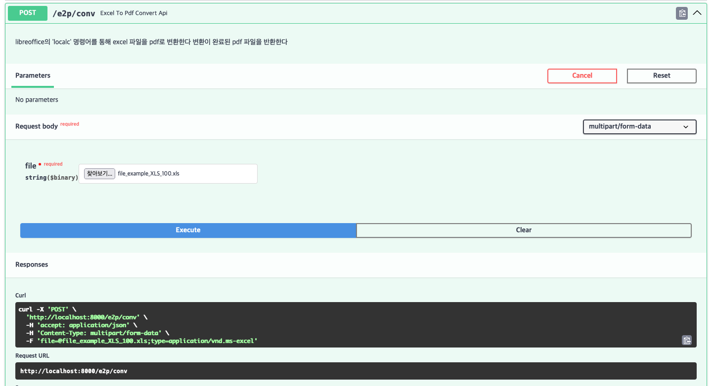

# Excel2PDFConverter API

Excel 파일을 PDF로 변환하기 위한 Converting API


## Intro

Libreoffice의 calc 명령어를 사용해서 excel을 pdf로 변환시킨다

- [Tip of the day: batch PDF conversion with LibreOffice](https://anarc.at/blog/2019-10-08-libreoffice-pdf-batch/)
- [Convert Text to PDF From the Command Line](https://www.baeldung.com/linux/convert-text-to-pdf)
- [How to Convert CSV to XLS or XSLX in Linux](https://www.baeldung.com/linux/csv-xls-xslx)
- [command-libreoffice-headless-convert-to-pdf-test-docx-outdir-pdf-is-not](https://stackoverflow.com/questions/30349542/command-libreoffice-headless-convert-to-pdf-test-docx-outdir-pdf-is-not)


## Try ~ History


### 1. [libreoffice SDK를 통한 converter 코드](project/utils/converter.py)
```text
subprocess를 사용하는게 아니라, uno와 libreoffice sdk를 사용하여 변환 코드를 작성하고자 하였으나
python 에서 uno 모듈을 사용하기 위해서는 libreoffice에서 제공되는(함께 설치되는) 파이썬을 사용해야 한다

-> 별도의 파이썬을 사용하므로 두개의 파이썬을 통합하여 사용할 방법이 떠오르지 않아, sdk의 사용을 포기함
```

### 2. 위의 SDK Converter 코드를 테스트 하던 중 확인한 내용이다
- [How python-uno can manipulate libreoffice-calc with pipe?](https://stackoverflow.com/questions/63663954/how-python-uno-can-manipulate-libreoffice-calc-with-pipe)
- [Couldn't connect to socket (LibreOffice)](https://github.com/crossroadchurch/malachi/issues/3)
```text
Libreoffice를 UNO를 통해 통신하기 위해서는 다음과 같이 socket를 허용하도록 실행해야 한다

$ libreoffice --calc --accept="socket,host=localhost,port=2002;urp;StarOffice.ServiceManager"

libreoffice를 같이 설치해서 실행시킨다 하더라도, container에 두 개의 프로세스가 실행되야 하는 상황이다(FastAPI, LibreOffice)
물론 불가능한 것은 아니나, 1 container에 1 process를 지향하고 있으므로 테스트 완료 후 결정하려 했으나 위 1번 사항이 문제가 되는 바람에
의미가 없어졌다
```

### 3. 결국, subprocess를 사용해서 실행하도록 했다
- [subprocess command](project/utils/command.py)
```text
source_file에 빈 값으로 넘어가는 경우 프로세스가 끝나지 않는 문제가 있어, 최대 실행 시간에 제한을 주고(180초)
변환 명령어를 실행하도록 하였다
```

```python
... 코드 일부

async def exec_run(cmd: str) -> None:
    try:
        await asyncio.wait_for(run_command(cmd), timeout=180)
    except asyncio.TimeoutError:
        raise RuntimeError("함수 실행이 시간 초과되었습니다")


async def run_command(cmd: str) -> None:
    proc = await asyncio.create_subprocess_shell(
        cmd, stdout=asyncio.subprocess.PIPE, stderr=asyncio.subprocess.PIPE
    )

    stdout, stderr = await proc.communicate()

    if proc.returncode != 0:
        raise RuntimeError(
            f"명령을 실행하는 도중에 문제가 발생하였습니다. command return code is {proc.returncode}"
        )

    if stderr:
        logger.error(stderr.decode())

```

### 4. 성능 문제가 나오지 않을까 싶다
- [unoserver](https://github.com/unoconv/unoserver)
- [unoconv - Deprecated](https://github.com/unoconv/unoconv)
```text
아무래도 office를 변환 때 마다 실행시키면 성능에 문제가 있을 것 같은데, unoconv를 보면 이런 성능 이슈를 어느정도 해결하기 위해 나온 것으로 보인다
일단 unoconv는 deprecated되었고 unoserver/unoconvert를 써야할 것 같다. 하지만, 이것도 1번 문제와 동일하게 파이썬을 함께 사용하지 못하는 문제가 있다
```

### Usage

Sample data

[Excel Sample Data](https://file-examples.com/index.php/sample-documents-download/sample-xls-download/) 중 [20kb 100rows](https://file-examples.com/wp-content/storage/2017/02/file_example_XLS_100.xls)로 테스트


```text
Error response from daemon: failed to create task for container: failed to create shim task: OCI runtime create failed: runc create failed: unable to start container process: exec: "./bin/entrypoint.local.sh": permission denied: unknown

$ chmod +x bin/entrypoint.local.sh
$ chmod +x bin/entrypoint.sh
```

### docker-compose
```shell
$ docker-compose -p e2p-api -f docker/docker-compose.yaml up -d --build
```

### docker image build & run
```shell
$ docker build -t e2p-api:1.0 -f docker/Dockerfile .
$ docker run -itd --name e2p-api -p 8000:8000  e2p-api:1.0
```

## Test

Swagger에서 Excel 파일을 업로드하여 PDF 변환되는 것을 확인한다

```shell
http://localhost:8000/docs
```


